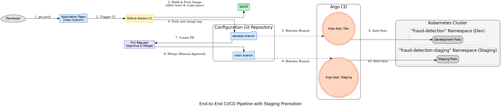

# Fraud Detection System - Kubernetes & GitOps Configuration

This repository contains all Kubernetes manifests required to deploy the [Real-Time Fraud Detection System](https://github.com/Mordris/fraud-detection-system). It acts as the **single source of truth** for the application's desired state across multiple environments, forming the core of a modern **GitOps** workflow managed by **Argo CD**.

The system is designed with a multi-environment promotion strategy, ensuring that changes are automatically tested, scanned, and deployed to a `development` environment before being manually promoted to `staging` via a controlled Pull Request process.

---

### The CI/CD and Promotion Workflow

This architecture represents a complete, automated software delivery lifecycle, from a developer's code commit to a controlled release in a staging environment.



**The process unfolds in two main stages:**

#### Stage 1: Continuous Delivery to Development

1.  **Code Push:** A developer pushes a code change to a microservice in the `main` branch of the `fraud-detection-system` repository.
2.  **CI Pipeline Trigger:** A dedicated GitHub Actions workflow automatically starts.
    - **Quality Gates:** The code is first validated with **automated tests (Pytest)** and **linting (Ruff)**.
    - **Build:** If quality checks pass, a new Docker image is built.
    - **Security Gate:** The new image is scanned for `HIGH` and `CRITICAL` vulnerabilities using **Trivy**.
3.  **Push to Registry:** If the security scan passes, the image is pushed to the GitHub Container Registry (GHCR) with a unique Git SHA tag.
4.  **Update `develop` Branch:** The CI pipeline then automatically checks out the **`develop` branch** of this repository (`fraud-detection-system-config`) and updates the corresponding image tag in the `development` overlay.
5.  **Automated Sync to Dev:** Argo CD, tracking the `develop` branch, detects the change and automatically syncs it, deploying the new version to the `fraud-detection` (development) namespace in Kubernetes.

#### Stage 2: Controlled Promotion to Staging

6.  **Create Pull Request:** After verifying the changes in the development environment, a team member creates a **Pull Request** in this repository to merge the `develop` branch into the `main` branch. This PR serves as a clear, auditable record of what is being promoted.
7.  **Manual Approval:** A senior developer or team lead reviews the Pull Request, ensuring the changes are ready for a more stable environment, and then approves and **merges** it.
8.  **Automated Sync to Staging:** Argo CD, tracking the `main` branch for the staging environment, detects the update and automatically syncs the changes, deploying the promoted versions to the isolated `fraud-detection-staging` namespace.

---

## Technology Stack

- **Orchestration:** Kubernetes (kind)
- **CI/CD & GitOps:** GitHub Actions, Argo CD
- **Configuration Management:** Kustomize
- **Containerization:** Docker, GHCR
- **Application Stack:** Python (FastAPI), Apache Flink, Redpanda, Redis
- **Quality & Security:** Pytest, Ruff, Trivy

---

## Repository Structure

The manifests are organized using a `base` and `overlays` structure to manage multiple environments cleanly.

```
k8s/
├── base/
│   ├── alert-monitor/
│   ├── flink/
│   └── payment-api/
└── overlays/
    ├── development/  # Tracks the 'develop' branch
    └── staging/      # Tracks the 'main' branch
```

- **`k8s/base/`**: Contains environment-agnostic Kubernetes manifests using placeholder image names.
- **`k8s/overlays/development/`**: Patches the `base` to deploy to the `fraud-detection` namespace. Image tags here are updated automatically by the CI pipeline.
- **`k8s/overlays/staging/`**: Patches the `base` to deploy to the `fraud-detection-staging` namespace. Image tags here are updated via the manual PR promotion process.

---

## Argo CD Application Definitions

Two Argo CD `Application` resources manage the two environments.

**Development App (`argocd-app.yaml`):**

```yaml
apiVersion: argoproj.io/v1alpha1
kind: Application
metadata:
  name: fraud-detection-system
  namespace: argocd
spec:
  project: default
  source:
    repoURL: https://github.com/Mordris/fraud-detection-system-config.git
    targetRevision: develop # <-- Tracks the develop branch
    path: k8s/overlays/development
  destination:
    server: https://kubernetes.default.svc
    namespace: fraud-detection
  syncPolicy:
    automated: { prune: true, selfHeal: true }
    syncOptions:
      - CreateNamespace=true
      - ServerSideApply=true
  ignoreDifferences:
    - group: batch
      kind: Job
      jsonPointers: ["/spec/selector", "/spec/template/metadata/labels"]
```

**Staging App (`argocd-staging-app.yaml`):**

```yaml
apiVersion: argoproj.io/v1alpha1
kind: Application
metadata:
  name: fraud-detection-system-staging
  namespace: argocd
spec:
  project: default
  source:
    repoURL: https://github.com/Mordris/fraud-detection-system-config.git
    targetRevision: main # <-- Tracks the main branch
    path: k8s/overlays/staging
  destination:
    server: https://kubernetes.default.svc
    namespace: fraud-detection-staging
  syncPolicy:
    automated: { prune: true, selfHeal: true }
    syncOptions:
      - CreateNamespace=true
      - ServerSideApply=true
  ignoreDifferences:
    - group: batch
      kind: Job
      jsonPointers: ["/spec/selector", "/spec/template/metadata/labels"]
```
