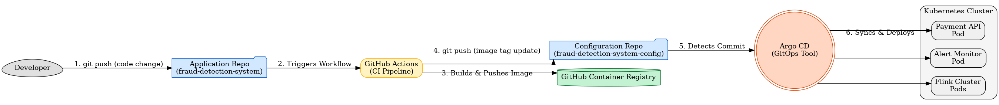

# Fraud Detection System - Kubernetes & GitOps Configuration

This repository contains all the Kubernetes manifests required to deploy the [Real-Time Fraud Detection System](https://github.com/Mordris/fraud-detection-system). It acts as the **single source of truth** for the application's desired state in the Kubernetes cluster, forming the core of a modern **GitOps** workflow managed by **Argo CD**.

While the main application repository holds the source code and CI pipelines, this repository defines the infrastructure, configuration, and deployment strategy.

---

### The GitOps Flow

The entire CI/CD process is automated. A `git push` to the application repository triggers a chain reaction that results in a new version being safely deployed to Kubernetes, with this repository acting as the crucial link between CI and CD.



## Technology Stack

This repository specifically manages the deployment and configuration using the following tools:

- **Kubernetes:** The container orchestration platform where the application runs.
- **Kustomize:** A template-free way to customize application configuration. It is used here to manage the differences between environments (e.g., development vs. production) by patching a common `base` set of manifests.
- **Argo CD:** The declarative, GitOps continuous delivery tool that synchronizes the state of the Kubernetes cluster with the manifests in this repository.
- **Helm:** Used to manage the deployment of third-party stateful services like Redpanda and Redis (though the charts themselves are not stored here).

---

## Repository Structure

The manifests are organized using the recommended Kustomize `base` and `overlays` structure.

```
k8s/
├── base/
│   ├── alert-monitor/  # Base manifests for the Alert Monitor service
│   ├── flink/          # Base manifests for the Flink cluster & Job submitter
│   └── payment-api/    # Base manifests for the Payment API service
└── overlays/
    └── development/    # Overlays for the 'development' environment
```

- **`k8s/base/`**: Contains the environment-agnostic, foundational Kubernetes manifests for each microservice. The `Deployment` files in the base use a generic `placeholder-repo/` image name.
- **`k8s/overlays/development/`**: Contains a `kustomization.yaml` file that patches the `base` manifests with details specific to the development environment. This is where the CI pipeline automatically updates the container image tags.

---

## The Automated Workflow in Detail

1.  **Code Push:** A developer pushes a code change to a specific microservice directory (e.g., `payment_api/`) in the `fraud-detection-system` repository.
2.  **CI Pipeline Trigger:** A dedicated GitHub Actions workflow, configured with path-based triggers, starts execution.
3.  **Build and Push:** The CI job builds a new Docker image, tags it with the unique Git commit SHA, and pushes it to the GitHub Container Registry (GHCR).
4.  **Checkout Config Repo:** A subsequent job in the same workflow checks out this repository (`fraud-detection-system-config`).
5.  **Update Manifest:** The job uses the `kustomize edit set image` command to update the image tag for the specific microservice in the `k8s/overlays/development/kustomization.yaml` file.
6.  **Commit and Push:** The workflow commits and pushes this change back to this repository, creating a fully audited record of the version change.
7.  **Argo CD Sync:** Argo CD, which is constantly monitoring this repository, detects the new commit.
8.  **Kubernetes Deployment:** Argo CD "pulls" the change and applies it to the cluster, triggering a safe, rolling update of the correct microservice with the new container image. The `flink-job-submitter` is handled as a transient Argo CD Hook to prevent sync errors.

---

## Manual Deployment

While the process is fully automated, the application can be deployed manually from this repository using `kubectl` and `kustomize`.

**Prerequisites:**

- A running Kubernetes cluster (e.g., `kind`, `minikube`).
- `kubectl` configured to point to the cluster.
- [Kustomize](https://kustomize.io/) installed.
- Stateful services (Redpanda, Redis) and Argo CD installed in the cluster.

**Deployment Command:**

```bash
# Navigate to the root of this repository
kubectl apply -k k8s/overlays/development
```

---

## Argo CD Bootstrap

The connection between Argo CD and this repository is established by applying an `Application` manifest to the cluster.

**`argocd-app.yaml`:**

````yaml
apiVersion: argoproj.io/v1alpha1
kind: Application
metadata:
  name: fraud-detection-system
  namespace: argocd
spec:
  project: default
  source:
    repoURL: https://github.com/Mordris/fraud-detection-system-config.git
    targetRevision: main
    path: k8s/overlays/development
  destination:
    server: https://kubernetes.default.svc
    namespace: fraud-detection
  syncPolicy:
    automated:
      prune: true
      selfHeal: true
    syncOptions:
      - CreateNamespace=true
      - ServerSideApply=true
  ignoreDifferences:
    - group: batch
      kind: Job
      jsonPointers:
        - /spec/selector
        - /spec/template/metadata/labels```
````
